  <picture>
    <source media="(prefers-color-scheme: dark)" srcset="assets/header-dark.svg">
    
  </picture>

  

  
  &nbsp;
  
  &nbsp;
  

BSc Computer Science graduate based in London, UK. I completed the **Leep Talent Data Technician Skills Bootcamp (May 2026)** and am actively looking for my next role across **data, security, and IT**. Longer-term, I'm building toward Security Engineering & Detection.

## Projects

### 📊 [BDO Analytics](https://github.com/chansg/bdo-analytics)

A real-time market-intelligence dashboard ingesting live Central Market data, surfacing best-seller rankings, price-stability scoring, and anomaly detection across a volatile, high-frequency dataset. Built as an end-to-end analytics product: ingestion → metrics → interactive dashboard with watchlists and CSV export.

**What it shows:** real-time data ingestion, time-series analysis, anomaly detection, and self-serve dashboarding — the core loop of an analytics role.

**Tools:** Python · pandas · Plotly · Streamlit

### 🎬 [Shorts Pipeline](https://github.com/chansg/shorts_pipeline)

Turning long gameplay recordings into polished short-form video normally takes hours of manual editing; I automated the full stack — CV-based highlight extraction, Whisper speech-to-text with per-speaker diarisation, AI image and video generation, caption burning, and audio mixing — behind a Gradio human-review gate, validated across 295 passing tests.

**Tools:** Python · ffmpeg · Whisper · Gemini API · ElevenLabs · OpenCV

### 🔎 [AI Security Log Analyser](https://github.com/chansg/ai-security-log-analyzer)

An anomaly-detection system combining an Isolation Forest model with a rule engine to flag suspicious patterns in authentication telemetry, surfaced through a Django dashboard. A practical exercise in unsupervised ML, feature engineering, and turning model output into something a human can actually triage.

**What it shows:** unsupervised anomaly detection, feature engineering, and operationalising model output into a usable interface.

**Tools:** Python · scikit-learn · Django · pandas

### 🤖 [Project Aria](https://github.com/chansg/aria)

A Windows voice assistant reframed as a personal study tool: it records and locally transcribes meetings with Whisper into timestamped, summarisable notes, and answers questions about whatever is on screen — *"what's wrong with line 6?"* on a SQL query — by reading the active window. A self-registering capability router (keyword → local semantic embedding → Claude) keeps every action observable and human-approved, backed by 441 passing tests.

**Tools:** Python · Claude API · Gemini · faster-whisper · Kokoro ONNX · SQLite

## Skills

| Data & Analysis | Languages | BI & Viz | Tooling |
|---|---|---|---|
| pandas, NumPy | Python | Power BI — DAX measures, KPI cards | Git, GitHub |
| Matplotlib, Seaborn | SQL — GROUP BY/HAVING, subqueries | Tableau — calculated fields, parameters | Streamlit |
| Data cleaning, EDA | MySQL Workbench | Excel — INDEX/MATCH, Pivot Tables, SUMIFS | PyCharm, scikit-learn |

<b>Where these techniques show up</b>

 
<table>
  <tr>
    <th align="left">Technique</th>
    <th align="left">Where it's proven</th>
  </tr>
  <tr>
    <td>Time-series analysis &amp; anomaly detection</td>
    <td><a href="https://github.com/chansg/bdo-analytics">BDO Analytics</a> — live market metrics, price-stability scoring, outlier flagging</td>
  </tr>
  <tr>
    <td>Unsupervised ML &amp; feature engineering</td>
    <td><a href="https://github.com/chansg/ai-security-log-analyzer">AI Security Log Analyser</a> — Isolation Forest over authentication telemetry</td>
  </tr>
  <tr>
    <td>DAX measures, KPI cards, drill-through</td>
    <td><a href="https://github.com/chansg/PowerBI">Power BI reports</a> — Desktop through to Service publication</td>
  </tr>
  <tr>
    <td>GROUP BY/HAVING, subqueries, schema design</td>
    <td><a href="https://github.com/chansg/SQL">SQL queries</a> — MySQL Workbench</td>
  </tr>
  <tr>
    <td>Calculated fields, filters, parameters</td>
    <td><a href="https://github.com/chansg/Tableau">Tableau dashboards</a> — interactive layouts on Tableau Public</td>
  </tr>
  <tr>
    <td>INDEX/MATCH, SUMIFS, Pivot Tables</td>
    <td><a href="https://github.com/chansg/Excel">Excel projects</a> — summary reporting from raw datasets</td>
  </tr>
</table>

## Activity

  <picture>
    <source media="(prefers-color-scheme: dark)" srcset="https://streak-stats.demolab.com?user=chansg&hide_border=true&background=0D1117&ring=58A6FF&fire=D29922&currStreakNum=E6EDF3&sideNums=E6EDF3&currStreakLabel=58A6FF&sideLabels=8B949E&dates=8B949E&stroke=30363D">
    
  </picture>

<!--
Contribution snake — one-time setup: enable GitHub Actions for this repo, run the
"generate-snake" workflow once (Actions tab -> generate-snake -> Run workflow),
then uncomment this block:

  <picture>
    <source media="(prefers-color-scheme: dark)" srcset="https://raw.githubusercontent.com/chansg/chansg/output/github-snake.svg">
    
  </picture>

-->

  <picture>
    <source media="(prefers-color-scheme: dark)" srcset="assets/status-dark.svg">
    
  </picture>

